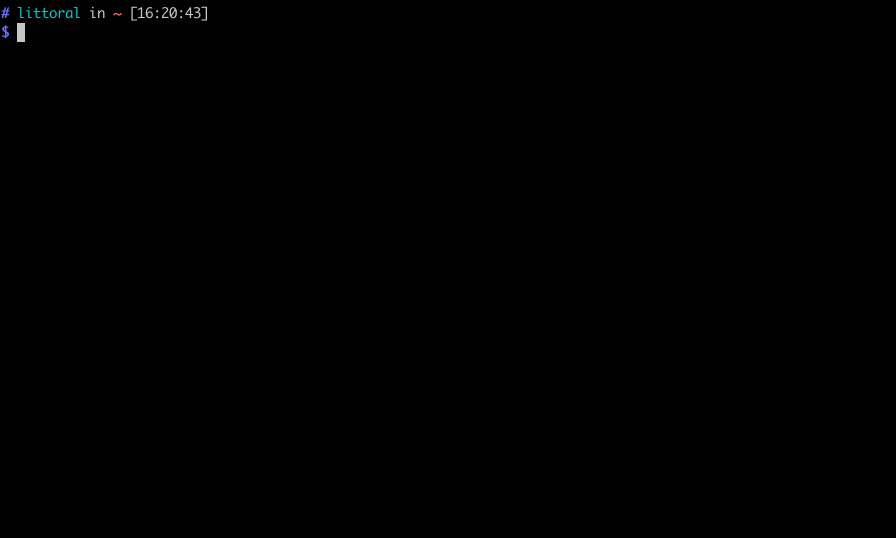
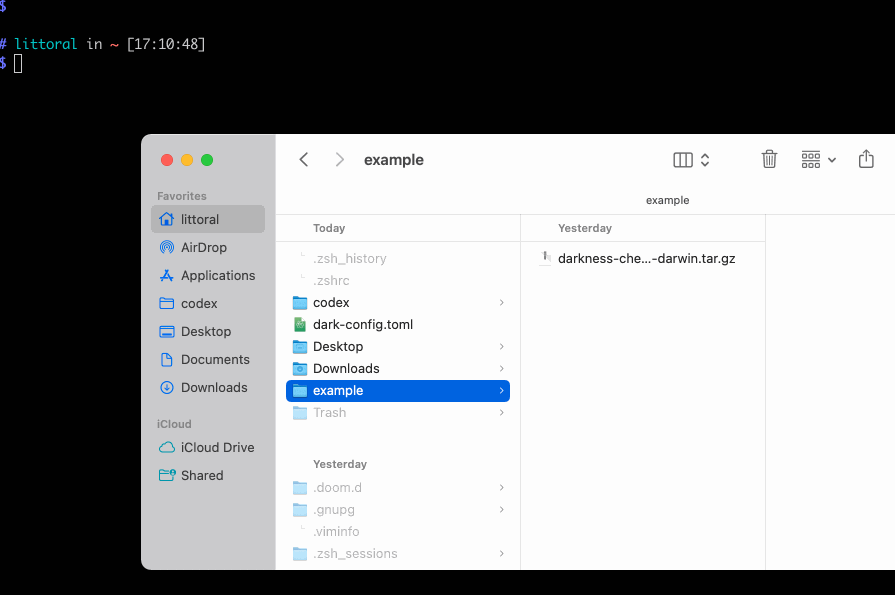

# Darkness Check

A little CLI, built in Rust that lets you find out how many hours of darkness you're in for today. 


## Usage 

There are a handful of ways to use the `darkness-check` app, balanced between looking up lat-long for locations yourself or getting an API key so the app can look it up for you.

### No Config: Bring Your Own Lat/Long Points 


```
darkness-check <LAT> <LONG>
```

NOTE: If you have provided an API key, this will fail and you should look up by city and country OR you can overwrite it by using the env variable



```
DARK_POINT="52.520008 13.404954" darkness-check 
```

### A Little Config


Put the latitude and longitude points in your `dark-config.toml` or `dark-config.json`.

```toml
# dark-config.toml
point = "52.520008 13.404954"
```

Then call it like this: 

```
darkness-check
```

The `dark-config` file must be in the same directory hierarchy as the executable. (That is, it can be in parent directory, etc.)

### More Config, More Flexibility


If you want to look up locations by name, you will need to create a free account at [API Ninjas](https://api-ninjas.com/) and add the `key` field to `dark-config.toml`.

```toml
# dark-config.toml
key = "API_KEY_FROM_API_NINJAS"
```

Then look up any city and country.

```
darkness-check berlin germany 
```

Put cities with multiple words in quotes.

```
darkness-check "mexico city" mexico
```

The `dark-config` file must be in the same directory hierarchy as the executable, but if you don't like that, the API key can also be provided as an environment variable.

```
DARK_KEY="jfhkaljkrhfjrhuljkhs" darkness-check berlin germany 
```

### Coming Soon

[ ] Add multiple points in the config.
[ ] Put the config file in a better place.

## Installation

There are two ways to install the tool: manually or using [`cargo install`](https://doc.rust-lang.org/book/ch14-04-installing-binaries.html). If you already use Rust, the latter is almost certainly easier. If you don't yet, but want to install it on your system, [start here](https://doc.rust-lang.org/cargo/getting-started/installation.html). And if don't want to install it on your system or are a control freak like me, you may find the manual install more to your liking.

### Manual

Download the [latest release](https://github.com/sarahghp/darkness/releases); decompress and add to your path.

#### Mac/Linux



Decompress either by double-clicking the dwnloaded file or with 

```bash

tar –xvf {downloaded-file-name}.tar.gz

```
Then, add the file to your `PATH`. One way to do this is to create a folder for your command line apps and add this whole folder to your `PATH`:

``` bash
cd ~ # move to your home folder 
mkdir bin # create a directory called bin
cd <UNCOMPRESSED_DARKNESS_DIRECTORY> # on a mac, to get this path you can drag the folder from finder into the command line
cp darkness-check ~/bin # move it to the directory we created 
echo "export PATH=$HOME/bin:$PATH" >> ~/.zshrc # replace  ~/.zshrc with ~/.bashrc
```

If the last line fails and tells you you do not have a `~/.zshrc` or `~/.bashrc`, you can create one using the `touch` command:

``` bash
touch ~/.bashrc
```

You can check that installation  was successful by opening a new terminal window and typing:

``` bash
which darkness-check
```

Now you can run `darkness-check`. Well, almost, if you're on a Mac. This is an unsigned app, so after you try to run it for the first time, you will get an error say it's unsigned. Go to `Security & Privacy > General`, and click `Allow anyway`. 

If you want to use a config file, I recommend adding it to `~`: `touch dark-config.toml`.

#### Windows

Windows users will also want to add the executable to their `$PATH`. Since I don't have a Windows machine, I have not tested it, but [this tutorial](https://www.howtogeek.com/118594/how-to-edit-your-system-path-for-easy-command-line-access/) and [this video](https://www.youtube.com/watch?v=AH3QeE_YhiU) show the steps.

If you run into issues or can provide more information, please feel free to open an issue or PR.

---

**Built as an @axodotdev onboarding project.**
